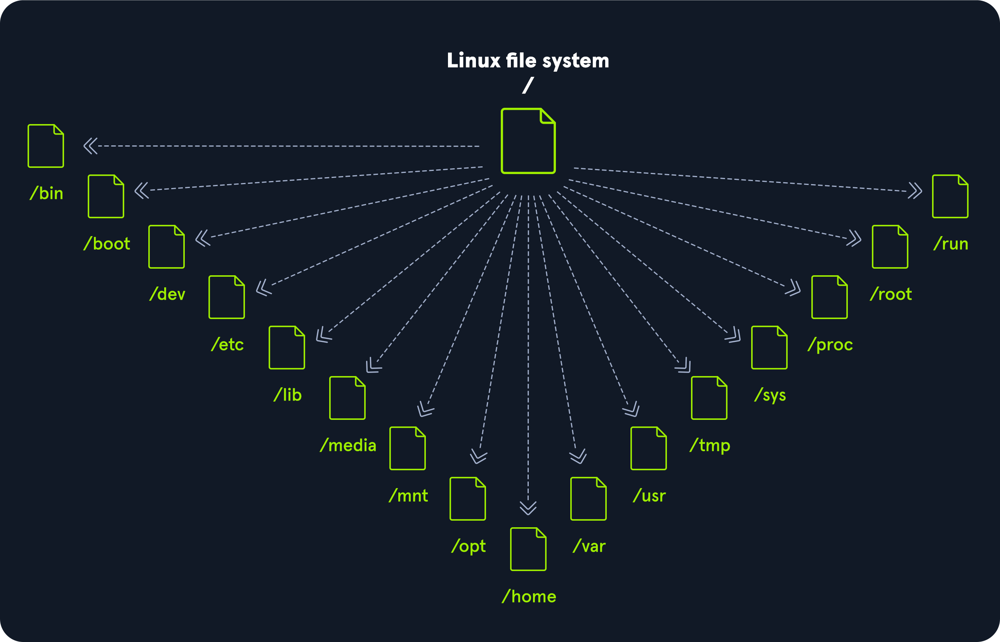

# Linux Structure and Architecture 🐧💻

## History 📜

The Linux operating system has a rich history, starting with the release of Unix in 1970 and the subsequent development of the Berkeley Software Distribution (BSD) in 1977. Richard Stallman's GNU project in 1983 laid the foundation for a free Unix-like operating system, leading to the creation of the Linux kernel in 1991 by Linus Torvalds. Now, with over 23 million source code lines, Linux is a widely adopted, secure, and versatile operating system.

## Philosophy 🤔

Linux follows five core principles, emphasizing file-centric configuration, small single-purpose programs, chaining programs for complex tasks, avoiding captive user interfaces, and storing configuration data in text files.

- **Everything is a file:** All configuration files for the various services running on the Linux operating system are stored in one or more text files.

- **Small, single-purpose programs:** Linux offers many different tools that we will work with, which can be combined to work together.

- **Ability to chain programs together to perform complex tasks:** The integration and combination of different tools enable us to carry out many large and complex tasks, such as processing or filtering specific data results.

- **Avoid captive user interfaces:** Linux is designed to work mainly with the shell (or terminal), which gives the user greater control over the operating system.

- **Configuration data stored in a text file:** Configuration data for Linux is stored in text files, promoting transparency and ease of manipulation.

## Components 🧩

- **Bootloader:** Guides the booting process (GRUB Bootloader in Parrot Linux).
- **OS Kernel:** Manages hardware resources at the hardware level.
- **Daemons:** Background services ensuring key functions work correctly.
- **OS Shell:** Interface between the OS and user (Bash, Tcsh/Csh, Ksh, Zsh, Fish).
- **Graphics Server:** Provides a graphical sub-system for running graphical programs.
- **Window Manager:** GUI (GNOME, KDE, MATE, Unity, Cinnamon).
- **Utilities:** Programs performing specific functions for the user or other programs.

## Linux Architecture 🏗️

### Layers

1. **Hardware:** Peripheral devices like RAM, hard drive, and CPU.
2. **Kernel:** Core of Linux, virtualizes and controls computer hardware resources.
3. **Shell:** Command-line interface allowing user input for kernel functions.
4. **System Utility:** Exposes all operating system functionality to the user.

### File System Hierarchy 📁

- **/**: Root filesystem, contains boot files and mount points.
- **/bin:** Essential command binaries.
- **/boot:** Static bootloader, kernel executable, and boot files.
- **/dev:** Device files for hardware devices.
- **/etc:** Local system configuration files.
- **/home:** User storage subdirectories.
- **/lib:** Shared library files for system boot.
- **/media:** Mount point for external removable media.
- **/mnt:** Temporary mount point for regular filesystems.
- **/opt:** Optional files for third-party tools.
- **/root:** Home directory for the root user.
- **/sbin:** Executables for system administration.
- **/tmp:** Directory for temporary files, cleared upon system boot.
- **/usr:** Contains executables, libraries, man files, etc.
- **/var:** Holds variable data files like log files, email in-boxes, and more. 📂

Explore the Linux ecosystem with its robust structure and versatile features! 🚀🐧
