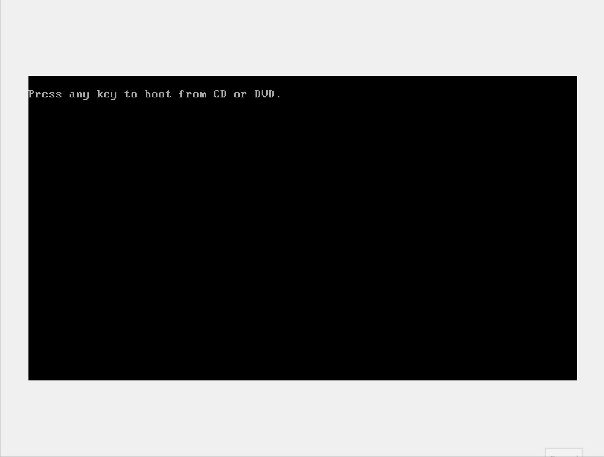

# Command Prompt Basics

The first step down the rabbit hole to developing our command-line kung fu is to dive into `cmd.exe` (the Command Prompt application). Let's begin our white-belt level training by going over what `cmd.exe` is, how to access it, and how the shell works.

### CMD.exe

The Command Prompt, also known as `cmd.exe` or CMD, is the default command-line interpreter for the Windows operating system. Originally based on the COMMAND.COM interpreter in DOS, the Command Prompt is ubiquitous across nearly all Windows operating systems. It allows users to input commands that are directly interpreted and then executed by the operating system. A single command can accomplish tasks such as changing a user's password or checking the status of network interfaces. This also reduces system resources, as graphical-based programs require more CPU and memory.

While often overshadowed by its sleek counterpart PowerShell, knowledge of `cmd.exe` and its commands continue to pay dividends even in modern times.

**Quick Story:** Several times during a pentest, I have run into hosts that had PowerShell locked down pretty well or made completely inaccessible through application control such as AppLocker. Using the Command Prompt, I could still leverage the host to acquire further access and elevate my privileges to continue the assessment. Modern operating systems have plenty of legacy software still embedded within the hosts. As admins and assessors alike, we must be aware of this and understand how to use them to our advantage.

### Accessing CMD

Before we can dig into the basic usage of Command Prompt, we have one fundamental question to answer first and foremost.

**How do we access the Command Prompt?**

There are multiple ways to access the Command Prompt on a Windows system. How you wish to access the prompt is up to personal preference as well as meeting specific criteria depending on the resources that are available at the time. Before explaining those criteria, there are some essential concepts to explain first.

#### Local Access vs. Remote Access

To help better explain these concepts, let us take a step back and remember our previous scenario:

**Scenario:** We are the system administrator at our company. As part of our daily duties and expectations, we must access machines from within our company's main headquarters and a branch office located in a different region to perform general maintenance and resolve technical issues. Let's say a user is having an issue with their machine, and you are called in to assist them. How do we best access their machine to most effectively resolve their issue?

Several scenarios here are possible depending on the questions we ask ourselves. Is the user located in the same region as us? Is the user in the same building? Is the user's office within reasonable walking distance? Is the user actively connected and working on their machine? These questions will generally factor into our decision from a System Administrator's point of view regarding how we will attempt to access the machine in question. However, we are getting slightly ahead of ourselves, so let's describe what accessing a machine entails and the available access types.

Generally speaking, computer access can be categorized into two main categories:

**Local Access**

Local access is synonymous with having direct physical access (or virtual in the instance of a Virtual Machine (VM)) to the machine itself. This level of access does not require the machine to be connected to a network, as it can be accessed directly through the peripherals (monitor, mouse, keyboard, etc.) connected to the machine. From the desktop, we can open up the command prompt by:

- Using the Windows key + r to bring up the run prompt, and then typing in `cmd`.
- Accessing the executable from the drive path `C:\Windows\System32\cmd.exe`.

##### cmd.exe Initial Access

```cmd
Microsoft Windows [Version 10.0.19044.2006]
(c) Microsoft Corporation. All rights reserved.

C:\Users\htb>
```

**Remote Access:**

On the other hand, remote access is the equivalent of accessing the machine using virtual peripherals over the network. This level of access does not require direct physical access to the machine but requires the user to be connected to the same network or have a route to the machine they intend to access remotely. We can do this through the use of telnet (insecure and not recommended), Secure Shell (SSH), PsExec, WinRM, RDP, or other protocols as needed. For a sysadmin, remote management and access are a boon to our workflow. We would not have to go to the user's desk and physically access the host to perform our duties. This convenience for sysadmins can also implant a security threat into our network. If these remote access tools are not configured correctly, or a threat gains access to valid credentials, an attacker can now have wide-ranging access to our environments. We must maintain the proper balance of availability and integrity of our networks for a proper security posture.

### Basic Usage

Looking at the Command Prompt, what we see now is similar to what it was decades ago. Moreover, navigation of the Command Prompt has remained mostly unchanged as well. Navigating through the file system is like walking down a hallway filled with doors. As we move into one hallway (directory), we can look to see what is there (using the `dir` command), then either issue additional commands or keep moving. Below, we will cover the basic shell layout, how to walk the halls, and how to acquire a map to get the lay of the land.

#### Using the `dir` Command

##### CMD Prompt

```cmd
Command Prompt Basics
C:\Users\htb\Desktop> dir

Volume in drive C has no label.
Volume Serial Number is DAE9-5896

Directory of C:\Users\htb\Desktop

06/11/2021 11:59 PM <DIR> .
06/11/2021 11:59 PM <DIR> ..
06/11/2021 11:57 PM 0 file1.txt
06/11/2021 11:57 PM 0 file2.txt
06/11/2021 11:57 PM 0 file3.txt
04/13/2021 11:24 AM 2,391 Microsoft Teams.lnk
06/11/2021 11:57 PM 0 super-secret-sauce.txt
06/11/2021 11:59 PM 0 write-secrets.ps1
6 File(s) 2,391 bytes
2 Dir(s) 35,102,117,888 bytes free
```

- The current path location (C:\Users\Desktop)
- The command we have issued (dir)
- The results of the command (output below the line the command was issued on)

When looking at the Command Prompt, it is a basic request-response type conversation. We requested a directory listing of the current working directory, and the system responded with the appropriate output.

**Case Study: Windows Recovery**

In the event of a user lockout or some technical issue preventing/inhibiting regular use of the machine, booting from a Windows installation disc gives us the option to boot to Repair Mode. From here, the user is provided access to a Command Prompt, allowing for command-line-based troubleshooting of the device.


**Accessing the Command Prompt via Recovery Mode**

While useful, this also poses a potential risk. For example, on this Windows 7 machine, we can use the recovery Command Prompt to tamper with the filesystem. Specifically, replacing the Sticky Keys (sethc.exe) binary with another copy of cmd.exe

Once the machine is rebooted, we can press Shift five times on the
