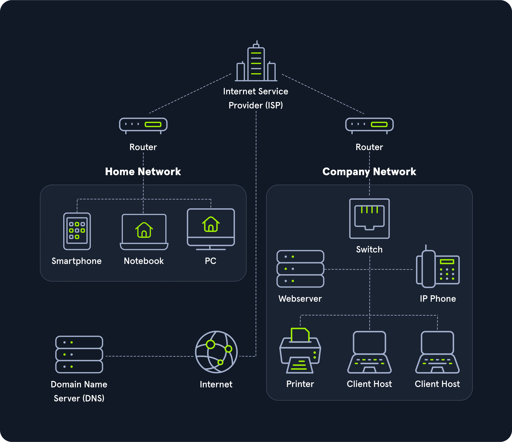

# Networking Overview

A network enables two computers to communicate with each other. There is a wide array of topologies (mesh/tree/star), mediums (ethernet/fiber/coax/wireless), and protocols (TCP/UDP/IPX) that can be used to facilitate the network. It is important as security professionals to understand networking because when the network fails, the error may be silent, causing us to miss something.

Setting up a large, flat network is not extremely difficult, and it can be a reliable network, at least operationally. However, a flat network is like building a house on a land plot and considering it secure because it has a lock on the door. By creating lots of smaller networks and having them communicate, we can add defense layers. Pivoting around a network is not difficult, but doing it quickly and silently is tough and will slow attackers down. Back to the house scenario, let's walk through the following examples:

### Example No. 1

Building smaller networks and putting Access Control Lists around them is like putting a fence around the property's border that creates specific entry and exit points. Yes, an attacker could jump over the fence, but this looks suspicious and is not common, allowing it to be quickly detected as malicious activity. Why is the printer network talking to the servers over HTTP?

### Example No. 2

Taking the time to map out and document each network's purpose is like placing lights around the property, making sure all activity can be seen. Why is the printer network talking to the internet at all?

### Example No. 3

Having bushes around windows is a deterrent to people attempting to open the window. Just like Intrusion Detection Systems like Suricata or Snort are a deterrent to running network scans. Why did a port scan originate from the printer network?

These examples may sound silly, and it is common sense to block a printer from doing all of the above. However, if the printer is on a "flat /24 network" and gets a DHCP address, it can be challenging to place these types of restrictions on them.

## Story Time - A Pentesters Oversight

Most networks use a /24 subnet, so much so that many Penetration Testers will set this subnet mask (255.255.255.0) without checking. The /24 network allows computers to talk to each other as long as the first three octets of an IP Address are the same (ex: 192.168.1.xxx). Setting the subnet mask to /25 divides this range in half, and the computer will be able to talk to only the computers on "its half." We have seen Penetration Test reports where the assessor claimed a Domain Controller was offline when it was just on a different network in reality. The network structure was something like this:

- Server Gateway: 10.20.0.1/25
- Domain Controller: 10.20.0.10/25
- Client Gateway: 10.20.0.129/25
- Client Workstation: 10.20.0.200/25
- Pentester IP: 10.20.0.252/24 (Set Gateway to 10.20.0.1)

The Pentester communicated with the Client Workstations and thought they did an excellent job because they managed to steal a workstation password via Impacket. However, due to a failure to understand the network, they never managed to get off the Client Network and reach more "high value" targets such as database servers. Hopefully, if this sounds confusing to you, you can come back to this statement at the end of the module and understand it!

## Basic Information

Let us look at the following high-level diagram of how a Work From Home setup may work.

The entire internet is based on many subdivided networks, as shown in the example and marked as "Home Network" and "Company Network." We can imagine networking as the delivery of mail or packages sent by one computer and received by the other.

Suppose we imagine as a scenario that we want to visit a company's website from our "Home Network." In that case, we exchange data with the company's website located in their "Company Network." As with sending mail or packets, we know the address where the packets should go. The website address or Uniform Resource Locator (URL) which we enter into our browser is also known as Fully Qualified Domain Name (FQDN).

The difference between URLs and FQDNs is that:

- an FQDN (www.hackthebox.eu) only specifies the address of the "building" and
- an URL (https://www.hackthebox.eu/example?floor=2&office=dev&employee=17) also specifies the "floor," "office," "mailbox" and the corresponding "employee" for whom the package is intended.

We will discuss the exact representations and definitions more clearly and precisely in other sections.

The fact is that we know the address, but not the exact geographical location of the address. In this situation, the post office can determine the exact location, which then forwards the packets to the desired location. Therefore, our post office forwards our packets to the main post office, representing our Internet Service Provider (ISP).

Our post office is our router which we utilize to connect to the "Internet" in networking.

As soon as we send our packet through our post office (router), the packet is forwarded to the main post office (ISP). This main post office looks in the address register/phonebook (Domain Name Service) where this address is located and returns the corresponding geographical coordinates (IP address). Now that we know the address's exact location, our packet is sent directly there by a direct flight via our main post office.

After the web server has received our packet with the request of what their website looks like, the webserver sends us back the packet with the data for the presentation of the website via the post office (router) of the "Company Network" to the specified return address (our IP address).

## Extra Points

In that diagram, I would hope the company network shown consists of five separate networks!

The Web Server should be in a DMZ (Demilitarized Zone) because clients on the internet can initiate communications with the website, making it more likely to become compromised. Placing it in a separate network allows the administrators to put networking protections between the web server and other devices.

Workstations should be on their own network, and in a perfect world, each workstation should have a Host-Based Firewall rule preventing it from talking to other workstations. If a Workstation is on the same network as a Server, networking attacks like spoofing or man in the middle become much more of an issue.

The Switch and Router should be on an "Administration Network." This prevents workstations from snooping in on any communication between these devices. I have often performed a Penetration Test and saw OSPF (Open Shortest Path First) advertisements. Since the router did not have a trusted network, anyone on the internal network could have sent a malicious advertisement and performed a man in the middle attack against any network.

IP Phones should be on their own network. Security-wise this is to prevent computers from being able to eavesdrop on communication. In addition to security, phones are unique in the sense that latency/lag is significant. Placing them on their own network can allow network administrators to prioritize their traffic to prevent high latency more easily.

Printers should be on their own network. This may sound weird, but it is next to impossible to secure a printer. Due to how Windows works, if a printer tells a computer authentication is required during a print job, that computer will attempt an NTLMv2 authentication, which can lead to passwords being stolen. Additionally, these devices are great for persistence and, in general, have tons of sensitive information sent to them.

## Fun Story

During COVID, I was tasked to perform a Physical Penetration Test across state lines, and my state was under a stay at home order. The company I was testing had minimal staff in the office. I decided to purchase an expensive printer and exploited it to put a reverse shell in it, so when it connected to the network, it would send me a shell (remote access). Then I shipped the printer to the company and sent a phishing email thanking the staff for coming in and explaining that the printer should allow them to print or scan things more quickly if they want to bring some stuff home to WFH for a few days. The printer was hooked up almost instantly, and their domain administrator's computer was kind enough to send the printer his credentials!

If the client had designed a secure network, this attack probably would not have been possible for many reasons:

- Printer should not have been able to talk to the internet
- Workstation should not have been able to communicate to the printer over port 445
- Printer should not be able to initiate connections to workstations. In some cases, printer/scanner combinations should be able to communicate to a mail server to email scanned documents.
