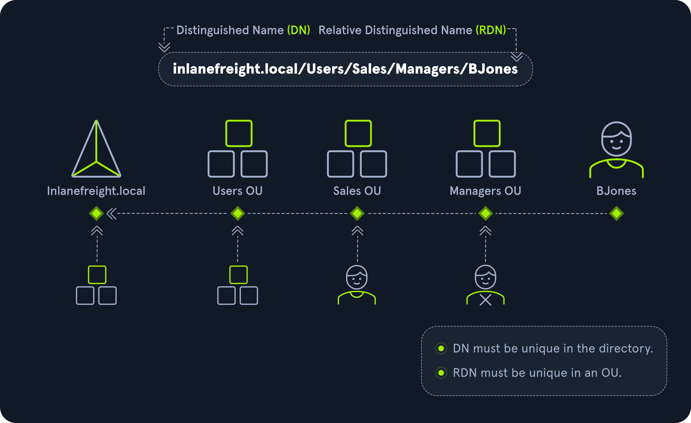

# Active Directory Structure

Active Directory (AD) is a directory service for Windows network environments. It is a distributed, hierarchical structure that allows for centralized management of an organization's resources, including users, computers, groups, network devices and file shares, group policies, servers and workstations, and trusts. AD provides authentication and authorization functions within a Windows domain environment. A directory service, such as Active Directory Domain Services (AD DS) gives an organization ways to store directory data and make it available to both standard users and administrators on the same network. AD DS stores information such as usernames and passwords and manages the rights needed for authorized users to access this information. It was first shipped with Windows Server 2000; it has come under increasing attack in recent years. It is designed to be backward-compatible, and many features are arguably not "secure by default." It is difficult to manage properly, especially in large environments where it can be easily misconfigured.

Active Directory flaws and misconfigurations can often be used to obtain a foothold (internal access), move laterally and vertically within a network, and gain unauthorized access to protected resources such as databases, file shares, source code, and more. AD is essentially a large database accessible to all users within the domain, regardless of their privilege level. A basic AD user account with no added privileges can be used to enumerate the majority of objects contained within AD, including but not limited to:

| **Domain Computers**                                  | **Domain Users**                                |
| ----------------------------------------------------- | ----------------------------------------------- |
| Represents all computer objects joined to the domain. | Represents all user accounts within the domain. |

| **Domain Group Information**                                                                                    | **Organizational Units (OUs)**                                                                                                                                                                          |
| --------------------------------------------------------------------------------------------------------------- | ------------------------------------------------------------------------------------------------------------------------------------------------------------------------------------------------------- |
| Contains information about groups created within the domain, including security groups and distribution groups. | Organizational units (OUs) are containers within a domain used to organize and manage objects like users, computers, and groups. OUs provide a way to apply policies and delegate administrative tasks. |

| **Default Domain Policy**                                                                                                        | **Functional Domain Levels**                                                                                                                                    |
| -------------------------------------------------------------------------------------------------------------------------------- | --------------------------------------------------------------------------------------------------------------------------------------------------------------- |
| Defines default settings and configurations applied to all objects within the domain. This policy is linked at the domain level. | The functional level of a domain determines which Active Directory features are available. It impacts the capabilities and compatibility of domain controllers. |

| **Password Policy**                                                                                       | **Group Policy Objects (GPOs)**                                                                                                                                                                                      |
| --------------------------------------------------------------------------------------------------------- | -------------------------------------------------------------------------------------------------------------------------------------------------------------------------------------------------------------------- |
| Specifies rules and requirements for user passwords, such as length, complexity, and expiration settings. | Group Policy Objects (GPOs) are containers for configuring and applying policy settings across domain-joined computers and users. GPOs can control security settings, software deployment, and other configurations. |

| **Domain Trusts**                                                                                                                                                                         | **Access Control Lists (ACLs)**                                                                                                                                                                            |
| ----------------------------------------------------------------------------------------------------------------------------------------------------------------------------------------- | ---------------------------------------------------------------------------------------------------------------------------------------------------------------------------------------------------------- |
| Domain trusts establish relationships between domains to allow authentication and access across domains. Trusts define the level of access one domain has to resources in another domain. | Access Control Lists (ACLs) are security descriptors attached to objects within Active Directory. ACLs define permissions and control access to objects like files, folders, and Active Directory objects. |

For this reason, we must understand how Active Directory is set up and the basics of administration before attempting to attack it. It's always easier to "break" things if we already know how to build them.

Active Directory is arranged in a hierarchical tree structure, with a forest at the top containing one or more domains, which can themselves have nested subdomains. A forest is the security boundary within which all objects are under administrative control. A forest may contain multiple domains, and a domain may include further child or sub-domains. A domain is a structure within which contained objects (users, computers, and groups) are accessible. It has many built-in Organizational Units (OUs), such as Domain Controllers, Users, Computers, and new OUs can be created as required. OUs may contain objects and sub-OUs, allowing for the assignment of different group policies.

At a very (simplistic) high level, an AD structure may look as follows:

```
  Active Directory Structure
INLANEFREIGHT.LOCAL/
├── ADMIN.INLANEFREIGHT.LOCAL
│   ├── GPOs
│   └── OU
│       └── EMPLOYEES
│           ├── COMPUTERS
│           │   └── FILE01
│           ├── GROUPS
│           │   └── HQ Staff
│           └── USERS
│               └── barbara.jones
├── CORP.INLANEFREIGHT.LOCAL
└── DEV.INLANEFREIGHT.LOCAL
```

Here we could say that INLANEFREIGHT.LOCAL is the root domain and contains the subdomains (either child or tree root domains) ADMIN.INLANEFREIGHT.LOCAL, CORP.INLANEFREIGHT.LOCAL, and DEV.INLANEFREIGHT.LOCAL as well as the other objects that make up a domain such as users, groups, computers, and more as we will see in detail below. It is common to see multiple domains (or forests) linked together via trust relationships in organizations that perform a lot of acquisitions. It is often quicker and easier to create a trust relationship with another domain/forest than recreate all new users in the current domain. As we will see in later modules, domain trusts can introduce a slew of security issues if not appropriately administered.


The graphic above shows two forests, INLANEFREIGHT.LOCAL and FREIGHTLOGISTICS.LOCAL. The two-way arrow represents a bidirectional trust between the two forests, meaning that users in INLANEFREIGHT.LOCAL can access resources in FREIGHTLOGISTICS.LOCAL and vice versa. We can also see multiple child domains under each root domain. In this example, we can see that the root domain trusts each of the child domains, but the child domains in forest A do not necessarily have trusts established with the child domains in forest B. This means that a user that is part of admin.dev.freightlogistics.local would NOT be able to authenticate to machines in the wh.corp.inlanefreight.local domain by default even though a bidirectional trust exists between the top-level inlanefreight.local and freightlogistics.local domains. To allow direct communication from admin.dev.freightlogistics.local and wh.corp.inlanefreight.local, another trust would need to be set up.


