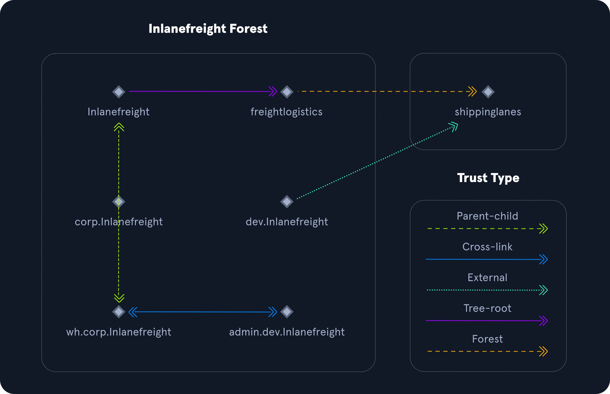

# Active Directory Objects

We will often see the term "objects" when referring to AD. What is an object? An object can be defined as ANY resource present within an Active Directory environment such as OUs, printers, users, domain controllers.

## AD Objects

### Users

These are the users within the organization's AD environment. Users are considered leaf objects, which means that they cannot contain any other objects within them. Another example of a leaf object is a mailbox in Microsoft Exchange. A user object is considered a security principal and has a security identifier (SID) and a global unique identifier (GUID). User objects have many possible attributes, such as their display name, last login time, date of last password change, email address, account description, manager, address, and more. Depending on how a particular Active Directory environment is set up, there can be over 800 possible user attributes when accounting for ALL possible attributes as detailed here. This example goes far beyond what is typically populated for a standard user in most environments but shows Active Directory's sheer size and complexity. They are a crucial target for attackers since gaining access to even a low privileged user can grant access to many objects and resources and allow for detailed enumeration of the entire domain (or forest).

### Contacts

A contact object is usually used to represent an external user and contains informational attributes such as first name, last name, email address, telephone number, etc. They are leaf objects and are NOT security principals (securable objects), so they don't have a SID, only a GUID. An example would be a contact card for a third-party vendor or a customer.

### Printers

A printer object points to a printer accessible within the AD network. Like a contact, a printer is a leaf object and not a security principal, so it only has a GUID. Printers have attributes such as the printer's name, driver information, port number, etc.

### Computers

A computer object is any computer joined to the AD network (workstation or server). Computers are leaf objects because they do not contain other objects. However, they are considered security principals and have a SID and a GUID. Like users, they are prime targets for attackers since full administrative access to a computer (as the all-powerful NT AUTHORITY\SYSTEM account) grants similar rights to a standard domain user and can be used to perform the majority of the enumeration tasks that a user account can (save for a few exceptions across domain trusts.)

### Shared Folders

A shared folder object points to a shared folder on the specific computer where the folder resides. Shared folders can have stringent access control applied to them and can be either accessible to everyone (even those without a valid AD account), open to only authenticated users (which means anyone with even the lowest privileged user account OR a computer account (NT AUTHORITY\SYSTEM) could access it), or be locked down to only allow certain users/groups access. Anyone not explicitly allowed access will be denied from listing or reading its contents. Shared folders are NOT security principals and only have a GUID. A shared folder's attributes can include the name, location on the system, security access rights.

### Groups

A group is considered a container object because it can contain other objects, including users, computers, and even other groups. A group IS regarded as a security principal and has a SID and a GUID. In AD, groups are a way to manage user permissions and access to other securable objects (both users and computers). Let's say we want to give 20 help desk users access to the Remote Management Users group on a jump host. Instead of adding the users one by one, we could add the group, and the users would inherit the intended permissions via their membership in the group. In Active Directory, we commonly see what are called "nested groups" (a group added as a member of another group), which can lead to a user(s) obtaining unintended rights. Nested group membership is something we see and often leverage during penetration tests. The tool BloodHound helps to discover attack paths within a network and illustrate them in a graphical interface. It is excellent for auditing group membership and uncovering/seeing the sometimes unintended impacts of nested group membership. Groups in AD can have many attributes, the most common being the name, description, membership, and other groups that the group belongs to. Many other attributes can be set, which we will discuss more in-depth later in this module.

### Organizational Units (OUs)

An organizational unit, or OU from here on out, is a container that systems administrators can use to store similar objects for ease of administration. OUs are often used for administrative delegation of tasks without granting a user account full administrative rights. For example, we may have a top-level OU called Employees and then child OUs under it for the various departments such as Marketing, HR, Finance, Help Desk, etc. If an account were given the right to reset passwords over the top-level OU, this user would have the right to reset passwords for all users in the company. However, if the OU structure were such that specific departments were child OUs of the Help Desk OU, then any user placed in the Help Desk OU would have this right delegated to them if granted. Other tasks that may be delegated at the OU level include creating/deleting users, modifying group membership, managing Group Policy links, and performing password resets. OUs are very useful for managing Group Policy (which we will study later in this module) settings across a subset of users and groups within a domain. For example, we may want to set a specific password policy for privileged service accounts so these accounts could be placed in a particular OU and then have a Group Policy object assigned to it, which would enforce this password policy on all accounts placed inside of it. A few OU attributes include its name, members, security settings, and more.

### Domain

A domain is the structure of an AD network. Domains contain objects such as users and computers, which are organized into container objects: groups and OUs. Every domain has its own separate database and sets of policies that can be applied to any and all objects within the domain. Some policies are set by default (and can be tweaked), such as the domain password policy. In contrast, others are created and applied based on the organization's need, such as blocking access to cmd.exe for all non-administrative users or mapping shared drives at log in.

### Domain Controllers

Domain Controllers are essentially the brains of an AD network. They handle authentication requests, verify users on the network, and control who can access the various resources in the domain. All access requests are validated via the domain controller and privileged access requests are based on predetermined roles assigned to users. It also enforces security policies and stores information about every other object in the domain.

### Sites

A site in AD is a set of computers across one or more subnets connected using high-speed links. They are used to make replication across domain controllers run efficiently.

### Built-in

In AD, built-in is a container that holds default groups in an AD domain. They are predefined when an AD domain is created.

### Foreign Security Principals

A foreign security principal (FSP) is an object created in AD to represent a security principal that belongs to a trusted external forest. They are created when an object such as a user, group, or computer from an external (outside of the current) forest is added to a group in the current domain. They are created automatically after adding a security principal to a group. Every foreign security principal is a placeholder object that holds the SID of the foreign object (an object that belongs to another forest.) Windows uses this SID to resolve the object's name via the trust relationship. FSPs are created in a specific container named ForeignSecurityPrincipals with a distinguished name like `cn=ForeignSecurityPrincipals,dc=inlanefreight,dc=local`.
