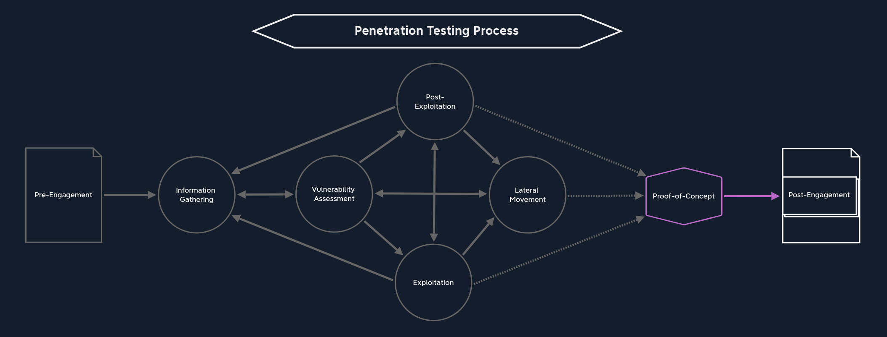

# **Proof-of-Concept**

`Proof of Concept` (`PoC`) or `Proof of Principle` is a project management term. In project management, it serves as proof that a project is feasible in principle. The criteria for this can lie in technical or business factors. Therefore, it is the basis for further work, in our case, the necessary steps to secure the corporate network by confirming the discovered vulnerabilities. In other words, it serves as a decision-making basis for the further course of action. At the same time, it enables risks to be identified and minimized.

This project step is often integrated into the development process for new application software (prototyping) or IT security solutions. For us in information security, this is where we prove vulnerabilities in operating systems or application software. We use this PoC to prove that a security problem exists so that the developers or administrators can validate it, reproduce it, see the impact, and test their remediation efforts. One of the most common examples used to prove software vulnerabilities is executing the calculator (calc.exe on Windows) on the target system. In principle, the PoC also assesses the probability of success of system access from actual exploitation.

A `PoC` can have many different representations. For example, `documentation` of the vulnerabilities found can also constitute a PoC. The more practical version of a PoC is a `script` or `code` that automatically exploits the vulnerabilities found. This demonstrates the flawless exploitation of the vulnerabilities. This variant is straightforward for an administrator or developer because they can see what steps our script takes to exploit the vulnerability.

However, there is one significant disadvantage that has occurred from time to time. Once the administrators and developers have received such a script from us, it is easy for them to "fight" against our script. They focus on changing the systems so that the script we created no longer works. The important thing is that the script is only `one way` of exploiting a given vulnerability. Therefore, working against our script instead of with it and modifying and securing the systems so that our script no longer works does not mean that the information obtained from the script cannot be obtained in another way. It is an important aspect that should be discussed with the administrators and developers and explicitly mentioned and pointed out.

The report they receive from us should help them see the entire picture, focus on the broader issues, and provide clear remediation advice. Including an attack chain walkthrough in the event of domain compromise during an internal is a great way to show how multiple flaws can be combined and how fixing one flaw will break the chain, but the other flaws will still exist. If these are not also fixed, there may be another path to get to the point where the attack chain was remediated and continue onwards. We should also drive this point home during our report review meeting.

For example, if a user uses the password `Password123`, the underlying vulnerability is not the password but the `password policy`. If a Domain Admin is found to be using that password and it is changed, that one account will now have a stronger password, but the problem of weak passwords will likely still be endemic within the organization.

If the password policy followed high standards, the user would not be able to use such a weak password. Administrators and developers are responsible for the functionality and the quality of their systems and applications. Furthermore, high quality stands for high standards, which we should emphasize through our remediation recommendations.
